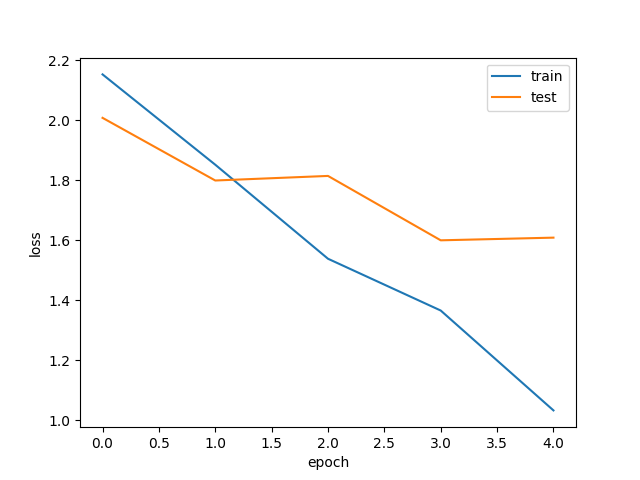

# Semi Supervised Learning (SSL) with Pytorch

## Usage

```bash
$ git clone git@github.com:HHorimoto/pytorch-semi-ss.git
$ cd pytorch-semi-ss
$ ~/python3.10/bin/python3 -m venv .venv
$ . .venv/bin/activate
$ pip install -r requirements.txt
$ source run_.sh
```

## Features

### Semi Supervised Learning (SSL)
I trained a model using Semi Supervised Learning with Consistency Regularization for 5 epochs on CIFAR-10, using 1,000 labeled samples and 49,000 unlabeled samples.
The table and figure below presents the experimental results.

**Comparison**

The table shows that **SSL** achieves higher accuracy than **SL**.
The test loss of **SSL** continues to decrease, suggesting better generalization.

|     | Accuracy |
| --- | :------: |
| SL  |  0.3727  |
| SSL | **0.43** |




#### Reference
[1] [https://github.com/machine-perception-robotics-group/MPRGDeepLearningLectureNotebook/blob/master/11_cnn_pytorch/13_semi_supervised_learning.ipynb](https://github.com/machine-perception-robotics-group/MPRGDeepLearningLectureNotebook/blob/master/11_cnn_pytorch/13_semi_supervised_learning.ipynb)